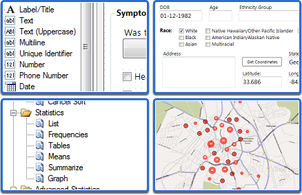

# Epi Info™
Epi Info™ is a public domain suite of software tools designed for the global community of public health practitioners and researchers. It provides for easy data entry form and database construction, a customized data entry experience, and data analyses with epidemiologic statistics, maps, and graphs for public health professionals who may lack an information technology background. Epi Info™ is used for outbreak investigations; for developing small to mid-sized disease surveillance systems; as analysis, visualization, and reporting (AVR) components of larger systems; and in the continuing education in the science of epidemiology and public health analytic methods at schools of public health around the world. The major components of Epi Info include:
>
* **MakeView** - a program for creating questionnaires, automatically creating the database, and customizing the data entry process
* **Enter** - a program for using the questionnaires created in MakeView to perform the data entry
* **Analysis** - a program for producing statistical analyses of data and diplaying the results as lists, tables, charts, or graphs
* **Epi Map** - a program for creating GIS maps overlayed with survey data
* **Epi Report** - a program for combining Analysis output into professional printer-ready format or saved as HTML files for easy web publishing.

“Epi Info™” is a trademark of the Centers for Disease Control and Prevention (CDC). 
The programs, documentation, and teaching materials are in the public domain and may be freely copied, distributed, and translated.

## Epi Info™ - Community Edition
Epi Info™ Community Edition is the open source project to reproduce the popular Epi Info™ suite of tools in C#, with the goal of developing a data collection and analytics system for public health that is highly scalable, platform independent, and database agnostic. While the Community Edition will be continuously developed with new features being prototyped regularly, public health professionals looking to perform critical activities are recommended to use the stable version of Epi Info™ available from the CDC's [Epi Info™ website](http://www.CDC.gov/EpiInfo).
### Overview Video
{video:url=http://www.youtube.com/watch?v=-uTHl9E6NK8,type=youtube,height=480,width=640}
--------
### Resources
* [CDC Epi Info website](http://www.cdc.gov/EpiInfo)
* [Epi Info community discussion board](http://www.phconnect.org/group/epiinfo)
* [Documentation](Documentation)
* [Epi Info™ project on JIRA](https://epiinfo.atlassian.net)
For more information, please contact the Epi Info™ Help Desk at [mailto:EpiInfo@CDC.gov](mailto:EpiInfo@CDC.gov).
